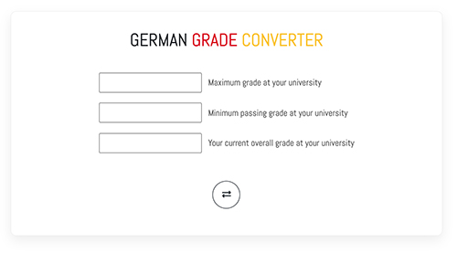

# german-grade
Grade converter for German grading system

The German grading system is different from other countries. When I was applying for the master's programs, I was struggling to convert my grade into the German system.The idea of building this calculator stem from this difficulty.

This tiny grade calculator converts the grades in GPA, percentage or american grading system into German grading system using Modified Bavarian Formula.

live preview : https://german-grade.web.app/

